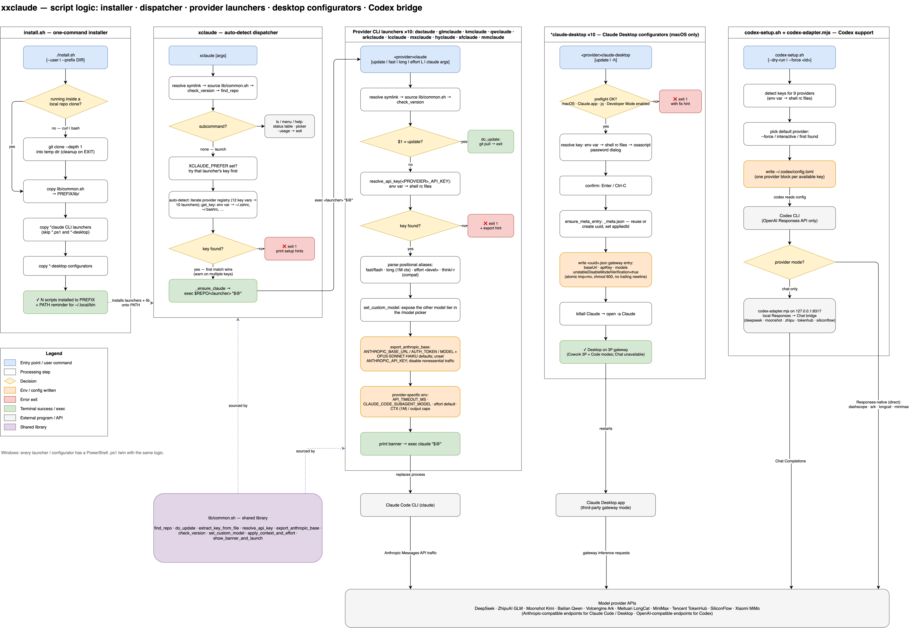

# dsclaude — Claude Code & Claude Desktop launchers for alternative backends

[中文文档](README_CN.md)

A collection of launchers and configurators that point [Claude Code](https://claude.ai/code) and Claude Desktop at third-party model backends (DeepSeek, MiMo, Qwen, GLM, Kimi, Ark, LongCat, MiniMax, TokenHub, SiliconFlow, etc.).

---

## Tools

| Tool | What it does | Platform | Backend |
| ------ | ------------- | ---------- | --------- |
| **[dsclaude](dsclaude)** | Claude Code CLI launcher | macOS / Linux | DeepSeek |
| **[dsclaude.ps1](dsclaude.ps1)** | Claude Code CLI launcher | Windows | DeepSeek |
| **[mmclaude](mmclaude)** | Claude Code CLI launcher | macOS / Linux | Xiaomi MiMo |
| **[mmclaude.ps1](mmclaude.ps1)** | Claude Code CLI launcher | Windows | Xiaomi MiMo |
| **[qwclaude](qwclaude)** | Claude Code CLI launcher | macOS / Linux | Alibaba Cloud Bailian (Qwen) |
| **[qwclaude.ps1](qwclaude.ps1)** | Claude Code CLI launcher | Windows | Alibaba Cloud Bailian (Qwen) |
| **[glmclaude](glmclaude)** | Claude Code CLI launcher | macOS / Linux | ZhipuAI GLM |
| **[glmclaude.ps1](glmclaude.ps1)** | Claude Code CLI launcher | Windows | ZhipuAI GLM |
| **[kmclaude](kmclaude)** | Claude Code CLI launcher | macOS / Linux | Moonshot AI Kimi |
| **[kmclaude.ps1](kmclaude.ps1)** | Claude Code CLI launcher | Windows | Moonshot AI Kimi |
| **[arkclaude](arkclaude)** | Claude Code CLI launcher | macOS / Linux | Volcengine Ark (doubao/Kimi/DeepSeek/GLM…) |
| **[arkclaude.ps1](arkclaude.ps1)** | Claude Code CLI launcher | Windows | Volcengine Ark (doubao/Kimi/DeepSeek/GLM…) |
| **[lcclaude](lcclaude)** | Claude Code CLI launcher | macOS / Linux | Meituan LongCat |
| **[lcclaude.ps1](lcclaude.ps1)** | Claude Code CLI launcher | Windows | Meituan LongCat |
| **[mxclaude](mxclaude)** | Claude Code CLI launcher | macOS / Linux | MiniMax |
| **[mxclaude.ps1](mxclaude.ps1)** | Claude Code CLI launcher | Windows | MiniMax |
| **[hyclaude](hyclaude)** | Claude Code CLI launcher | macOS / Linux | Tencent TokenHub (HY3/DeepSeek/Kimi/GLM…) |
| **[hyclaude.ps1](hyclaude.ps1)** | Claude Code CLI launcher | Windows | Tencent TokenHub (HY3/DeepSeek/Kimi/GLM…) |
| **[sfclaude](sfclaude)** | Claude Code CLI launcher | macOS / Linux | SiliconFlow (DeepSeek/Kimi/GLM/Qwen/Yi…) |
| **[sfclaude.ps1](sfclaude.ps1)** | Claude Code CLI launcher | Windows | SiliconFlow (DeepSeek/Kimi/GLM/Qwen/Yi…) |
| **[xclaude](xclaude)** | Unified auto-detect launcher | macOS / Linux | Any (auto-detects from API keys) |
| **[dsclaude-desktop](dsclaude-desktop)** | Claude Desktop GUI configurator | macOS | DeepSeek |
| **[dsclaude-desktop.ps1](dsclaude-desktop.ps1)** | Claude Desktop GUI configurator | Windows | DeepSeek |
| **[mmclaude-desktop](mmclaude-desktop)** | Claude Desktop GUI configurator | macOS | Xiaomi MiMo |
| **[mmclaude-desktop.ps1](mmclaude-desktop.ps1)** | Claude Desktop GUI configurator | Windows | Xiaomi MiMo |
| **[qwclaude-desktop](qwclaude-desktop)** | Claude Desktop GUI configurator | macOS | Alibaba Cloud Bailian (Qwen) |
| **[qwclaude-desktop.ps1](qwclaude-desktop.ps1)** | Claude Desktop GUI configurator | Windows | Alibaba Cloud Bailian (Qwen) |
| **[glmclaude-desktop](glmclaude-desktop)** | Claude Desktop GUI configurator | macOS | ZhipuAI GLM |
| **[glmclaude-desktop.ps1](glmclaude-desktop.ps1)** | Claude Desktop GUI configurator | Windows | ZhipuAI GLM |
| **[kmclaude-desktop](kmclaude-desktop)** | Claude Desktop GUI configurator | macOS | Moonshot AI Kimi |
| **[kmclaude-desktop.ps1](kmclaude-desktop.ps1)** | Claude Desktop GUI configurator | Windows | Moonshot AI Kimi |
| **[arkclaude-desktop](arkclaude-desktop)** | Claude Desktop GUI configurator | macOS | Volcengine Ark |
| **[arkclaude-desktop.ps1](arkclaude-desktop.ps1)** | Claude Desktop GUI configurator | Windows | Volcengine Ark |
| **[lcclaude-desktop](lcclaude-desktop)** | Claude Desktop GUI configurator | macOS | Meituan LongCat |
| **[lcclaude-desktop.ps1](lcclaude-desktop.ps1)** | Claude Desktop GUI configurator | Windows | Meituan LongCat |
| **[mxclaude-desktop](mxclaude-desktop)** | Claude Desktop GUI configurator | macOS | MiniMax |
| **[mxclaude-desktop.ps1](mxclaude-desktop.ps1)** | Claude Desktop GUI configurator | Windows | MiniMax |
| **[hyclaude-desktop](hyclaude-desktop)** | Claude Desktop GUI configurator | macOS | Tencent TokenHub |
| **[hyclaude-desktop.ps1](hyclaude-desktop.ps1)** | Claude Desktop GUI configurator | Windows | Tencent TokenHub |
| **[sfclaude-desktop](sfclaude-desktop)** | Claude Desktop GUI configurator | macOS | SiliconFlow |
| **[sfclaude-desktop.ps1](sfclaude-desktop.ps1)** | Claude Desktop GUI configurator | Windows | SiliconFlow |
| **[skills/deepseek-vision](skills/deepseek-vision/)** | Vision skill (zero deps) | macOS / Linux | DashScope Qwen |
| **[dsvision-mcp](dsvision-mcp)** | Vision MCP server | macOS / Linux | DashScope Qwen |

---

## How it works



Script-logic overview: the installer, the `xclaude` auto-detect dispatcher, the provider CLI launchers, the Claude Desktop configurators, and the Codex bridge — all sharing `lib/common.sh`. The PNG has the draw.io XML embedded, so opening it in [draw.io](https://app.diagrams.net) recovers the editable diagram ([source](docs/xxclaude-logic.drawio) · [中文版](docs/xxclaude-logic-cn.drawio.png)).

---

## Quick start on macOS

```bash
# One-line install (recommended):
curl -fsSL https://raw.githubusercontent.com/Agents365-ai/dsclaude/main/install.sh | bash

# Or user install (no sudo):
curl -fsSL https://raw.githubusercontent.com/Agents365-ai/dsclaude/main/install.sh | bash -s -- --user

# Or manual:
git clone https://github.com/Agents365-ai/dsclaude.git
cd dsclaude
chmod +x xclaude
./xclaude
```

## Quick start on Windows

```powershell
# One-line install (PowerShell as admin recommended):
irm https://raw.githubusercontent.com/Agents365-ai/dsclaude/main/install.ps1 | iex

# Install with auto-PATH:
irm https://raw.githubusercontent.com/Agents365-ai/dsclaude/main/install.ps1 | iex -AddToPath

# Then launch:
pwsh -File xclaude.ps1
```

---

## xclaude — Unified auto-detect launcher

Don't remember which script to run? `xclaude` auto-detects your API key and delegates to the right backend.

```bash
# Set any one of these in your ~/.zshrc:
export DEEPSEEK_API_KEY=sk-...     # → dsclaude
export GLM_API_KEY=...              # → glmclaude
export KIMI_API_KEY=sk-...          # → kmclaude
export ARK_API_KEY=...              # → arkclaude
# ... or any other supported key

xclaude                  # auto-detect and launch
xclaude fast             # ...with fast/flash tier
xclaude long effort max  # ...with 1M context + max effort
xclaude kimi             # forwarded: on Ark → kimi model, etc.
```

All positional args (model aliases, `fast`, `long`, `effort`, etc.) are forwarded to the underlying launcher. If multiple keys are set, the first found wins; set `XCLAUDE_PREFER=dsclaude` to force a specific provider.

---

## dsclaude — Claude Code on DeepSeek

Follows the [DeepSeek Anthropic API](https://api-docs.deepseek.com/guides/anthropic_api) guide.

```bash
export DEEPSEEK_API_KEY=sk-xxxxxxxxxxxxxxxxxx   # add to ~/.zshrc

dsclaude                 # default: deepseek-v4-pro (full reasoning)
dsclaude fast            # deepseek-v4-flash (cheaper / faster)
dsclaude long            # request 1M context window
dsclaude long fast       # 1M + flash
```

Sets the DeepSeek-recommended env vars (`ANTHROPIC_BASE_URL`, model mappings, `CLAUDE_CODE_EFFORT_LEVEL=max`), and exposes the alternate model in Claude Code's `/model` picker. Override context window via `DSCLAUDE_MAX_TOKENS` and effort via `DSCLAUDE_EFFORT`.

> Both models natively support 1M-token context. The `[1m]` suffix (e.g. `deepseek-v4-pro[1m]`) is required in Claude Code — `dsclaude` sets it automatically.
>
> Windows (PowerShell 7+): `pwsh -File ./dsclaude.ps1` (same flags).

---

## mmclaude — Claude Code on Xiaomi MiMo

```bash
export MIMO_API_KEY=sk-xxxxxxxxxxxxxxxxxx       # pay-as-you-go
# or
export MIMO_API_KEY=tp-xxxxxxxxxxxxxxxxxx       # Token Plan

mmclaude                  # start on mimo-v2.5-pro
mmclaude fast             # start on mimo-v2.5 (cheaper / faster flash tier)
mmclaude update           # git pull
```

Auto-detects base URL from the key prefix (`sk-*` → public, `tp-*` → Token Plan); override with `MIMO_BASE_URL`. Main/opus/sonnet slots run `mimo-v2.5-pro` while the haiku and subagent tiers run `mimo-v2.5` (flash); `mmclaude fast` flips the main model to flash, and the other tier is exposed in the `/model` picker for mid-session switching. Unsets `ANTHROPIC_API_KEY` (per MiMo docs). Override the tiers with `MIMO_MODEL` / `MIMO_FLASH_MODEL`.

> Windows (PowerShell 7+): `pwsh -File ./mmclaude.ps1` (same flags).

---

## qwclaude — Claude Code on Alibaba Cloud Bailian (Qwen)

```bash
# One key per plan — each comes from a different Bailian console entry:
export DASHSCOPE_API_KEY=sk-xxxxxxxxxxxxxxxxxx      # pay-as-you-go
export DASHSCOPE_CP_API_KEY=sk-xxxxxxxxxxxxxxxxxx   # Coding Plan
export DASHSCOPE_TP_API_KEY=sk-xxxxxxxxxxxxxxxxxx   # Token Plan team edition

# macOS / Linux — three model tiers
qwclaude                  # pay-as-you-go, qwen3.7-max (Beijing)     → DASHSCOPE_API_KEY
qwclaude plus             # qwen3.7-plus (balanced, ~1/6 cost of max)
qwclaude max              # explicit qwen3.7-max
qwclaude fast             # qwen3.6-flash as the main model
qwclaude intl             # pay-as-you-go on the Singapore endpoint
qwclaude coding           # Coding Plan (qwen3.7-plus recommended)   → DASHSCOPE_CP_API_KEY
qwclaude coding plus      # Coding Plan, qwen3.7-plus (default)
qwclaude coding fast      # Coding Plan, qwen3.6-plus
qwclaude token            # Token Plan (qwen3.7-max)                 → DASHSCOPE_TP_API_KEY
qwclaude token plus       # Token Plan, qwen3.7-plus
qwclaude update           # git pull

# Windows (PowerShell 7+)
pwsh -File ./qwclaude.ps1 coding
```

Picks the base URL, model lineup, and API-key variable per billing plan and model tier. Three model tiers:

| Tier | Pay-as-you-go & Token Plan | Coding Plan |
| ------ | --------------------------- | ------------- |
| **max** (default) | `qwen3.7-max` (flagship) | N/A |
| **plus** | `qwen3.7-plus` (balanced, ~1/6 cost) | `qwen3.7-plus` (recommended) |
| **flash** (subagent/haiku) | `qwen3.6-flash` | `qwen3.6-plus` |

Main/opus/sonnet slots run the selected tier (default `qwen3.7-max`) while the haiku + subagent tiers always use the flash model. `fast` flips the main model to flash; `plus` flips to qwen3.7-plus. The other tier is exposed in the `/model` picker for mid-session switching. Sets `CLAUDE_CODE_DISABLE_NONESSENTIAL_TRAFFIC=1` and unsets `ANTHROPIC_API_KEY` to keep traffic on Bailian. Override via `QWEN_PLAN` / `QWEN_REGION` / `QWEN_MODEL` / `QWEN_PLUS_MODEL` / `QWEN_FLASH_MODEL` / `QWEN_BASE_URL`.

> The Windows port (`qwclaude.ps1`) requires PowerShell 7+ (`winget install Microsoft.PowerShell`) — run it with `pwsh -File`.

---

## glmclaude — Claude Code on ZhipuAI GLM

Follows ZhipuAI's Anthropic-compatible API.

```bash
export GLM_API_KEY=your_zhipu_api_key           # add to ~/.zshrc
# Get your key at: https://open.bigmodel.cn/usercenter/apikeys

glmclaude                  # default: glm-5.2 (full reasoning)
glmclaude fast             # glm-4.7 (cheaper / faster)
glmclaude update           # git pull
```

Sets the ZhipuAI-recommended env vars (`ANTHROPIC_BASE_URL`, model mappings), and exposes the alternate model in Claude Code's `/model` picker. Main/opus/sonnet slots run `glm-5.2` while the haiku and subagent tiers run `glm-4.7`; `glmclaude fast` flips the main model to flash, and the other tier is exposed in the `/model` picker for mid-session switching.

By default uses the China endpoint (`https://open.bigmodel.cn/api/anthropic`). For the international endpoint, set `GLM_BASE_URL`:

```bash
export GLM_BASE_URL=https://api.z.ai/api/anthropic
glmclaude
```

Override the tiers with `GLM_MODEL` / `GLM_FLASH_MODEL`.

> Windows (PowerShell 7+): `pwsh -File ./glmclaude.ps1` (same flags).

---

## kmclaude — Claude Code on Moonshot AI Kimi

```bash
export KIMI_API_KEY=sk-xxxxxxxxxxxxxxxxxx       # add to ~/.zshrc
# Get your key at: https://platform.moonshot.cn/console/api-keys

kmclaude                  # start on kimi-k3 (flagship)
kmclaude fast             # start on kimi-k2.5 (cheaper / faster tier)
kmclaude update           # git pull
```

Uses the official Kimi Anthropic-compatible endpoint (`https://api.moonshot.cn/anthropic`). Main/opus/sonnet slots run `kimi-k3` while the haiku and subagent tiers run `kimi-k2.5`; `kmclaude fast` flips the main model to k2.5, and the other tier is exposed in the `/model` picker for mid-session switching. Unsets `ANTHROPIC_API_KEY` to avoid credential shadowing. Override the tiers with `KIMI_MODEL` / `KIMI_FLASH_MODEL` and the base URL with `KIMI_BASE_URL`.

> Windows (PowerShell 7+): `pwsh -File ./kmclaude.ps1` (same flags).

---

## dsclaude-desktop — Claude Desktop GUI configurator

One-command configurator for Claude Desktop's built-in **Third-Party Inference** feature (Developer menu), pre-filled for DeepSeek.

### Prerequisites

1. Claude Desktop installed ([claude.ai/download](https://claude.ai/download))
2. Developer Mode enabled (Help → Troubleshooting → Enable Developer Mode, once)
3. `DEEPSEEK_API_KEY` environment variable set

### Usage

```bash
export DEEPSEEK_API_KEY=sk-xxxxxxxxxxxxxxxxxx
./dsclaude-desktop        # configure and restart
./dsclaude-desktop -h     # help
```

Generates an entry under `~/Library/Application Support/Claude-3p/configLibrary/`, sets it as `appliedId` in `_meta.json`, then restarts the app. Existing GUI-added entries are preserved.

### Switching modes

Claude Desktop's launch chooser handles Anthropic ↔ Gateway switching natively — no `--revert` flag. Click your profile → **Disconnect** (or sign out), then pick the other option at next launch.

> Classic **Chat** (claude.ai-style) is unavailable in Gateway mode — it depends on Anthropic-hosted features not exposed via the inference API. Switch back to Anthropic mode to use it.

### Windows

```powershell
$env:DEEPSEEK_API_KEY = "sk-xxxxxxxxxxxxxxxxxx"
pwsh ./dsclaude-desktop.ps1
```

Writes to `%APPDATA%\Claude-3p\configLibrary\`. > Untested by the maintainer — please [open an issue](https://github.com/Agents365-ai/dsclaude/issues) if anything misbehaves.

---
Prerequisites: Claude Desktop installed (Store or standard), DeepSeek API key. Unlike macOS, Developer Mode is **auto-enabled** by the script — no manual GUI toggle needed.

Config path: `%LOCALAPPDATA%\Claude-3p\configLibrary\` (for Store/MSIX installs, the script also writes to the sandboxed package path as a fallback).

Tested on Windows 11 with Claude Desktop 1.7196 (Windows Store, arm64).

---

## mmclaude-desktop — Claude Desktop on Xiaomi MiMo

Same configurator as `dsclaude-desktop`, pre-filled for Xiaomi MiMo. Reads `MIMO_API_KEY` and auto-detects the base URL from the key prefix (`tp-*` → Token Plan, else pay-as-you-go; override with `MIMO_BASE_URL`). Configures `mimo-v2.5-pro` + `mimo-v2.5`.

```bash
export MIMO_API_KEY=sk-xxxxxxxxxxxxxxxxxx   # or tp-... for Token Plan
./mmclaude-desktop        # configure and restart (macOS)
./mmclaude-desktop -h     # help

# Windows (PowerShell)
$env:MIMO_API_KEY = "sk-xxxxxxxxxxxxxxxxxx"
pwsh ./mmclaude-desktop.ps1
```

---

## qwclaude-desktop — Claude Desktop on Alibaba Cloud Bailian (Qwen)

Same configurator, with per-plan base URL, models, and key variable. Pay-as-you-go (`DASHSCOPE_API_KEY`) and Token Plan (`DASHSCOPE_TP_API_KEY`) default to `qwen3.7-max` + `qwen3.6-flash`; Coding Plan (`DASHSCOPE_CP_API_KEY`) configures `qwen3.7-plus` + `qwen3.6-plus`. Add `plus` to use qwen3.7-plus for any plan.

```bash
export DASHSCOPE_API_KEY=sk-xxxxxxxxxxxxxxxxxx       # pay-as-you-go
export DASHSCOPE_CP_API_KEY=sk-xxxxxxxxxxxxxxxxxx    # Coding Plan
export DASHSCOPE_TP_API_KEY=sk-xxxxxxxxxxxxxxxxxx    # Token Plan

./qwclaude-desktop            # pay-as-you-go (Beijing), qwen3.7-max, then restart
./qwclaude-desktop plus       # pay-as-you-go, qwen3.7-plus
./qwclaude-desktop intl       # pay-as-you-go, Singapore endpoint
./qwclaude-desktop coding     # Coding Plan (qwen3.7-plus)
./qwclaude-desktop token      # Token Plan, qwen3.7-max
./qwclaude-desktop token plus # Token Plan, qwen3.7-plus

# Windows (PowerShell)
pwsh ./qwclaude-desktop.ps1 -Plan coding
pwsh ./qwclaude-desktop.ps1 -Plan token -ModelTier plus
```

> The `.ps1` Windows ports mirror `dsclaude-desktop.ps1` and are **untested by the maintainer** — please [open an issue](https://github.com/Agents365-ai/dsclaude/issues) if anything misbehaves. Both configurators set `unstableDisableModelVerification` so Claude Desktop accepts the non-Anthropic model names, and (like `dsclaude-desktop`) disable Chat mode while the gateway is active.

---

## glmclaude-desktop — Claude Desktop on ZhipuAI GLM

Same configurator, pre-filled for ZhipuAI GLM. Reads `GLM_API_KEY`. Configures `glm-5.2` + `glm-4.7`.

```bash
export GLM_API_KEY=your_zhipu_api_key
./glmclaude-desktop        # configure and restart (macOS)
./glmclaude-desktop -h     # help

# Windows (PowerShell)
$env:GLM_API_KEY = "your_zhipu_api_key"
pwsh ./glmclaude-desktop.ps1
```

Override the base URL with `GLM_BASE_URL` (default: `https://open.bigmodel.cn/api/anthropic`).

---

## kmclaude-desktop — Claude Desktop on Moonshot AI Kimi

Same configurator, pre-filled for Moonshot Kimi. Reads `KIMI_API_KEY`. Configures `kimi-k3` + `kimi-k2.5`.

```bash
export KIMI_API_KEY=sk-xxxxxxxxxxxxxxxxxx
./kmclaude-desktop        # configure and restart (macOS)
./kmclaude-desktop -h     # help

# Windows (PowerShell)
$env:KIMI_API_KEY = "sk-xxxxxxxxxxxxxxxxxx"
pwsh ./kmclaude-desktop.ps1
```

Override the base URL with `KIMI_BASE_URL` (default: `https://api.moonshot.cn/anthropic`).

---

## arkclaude — Claude Code on Volcengine Ark (Coding Plan)

Volcengine Ark's Coding Plan aggregates multiple model families under one subscription — doubao, Kimi, DeepSeek, GLM, MiniMax, and more. One API key, one endpoint, many models.

```bash
export ARK_API_KEY=your_ark_api_key           # add to ~/.zshrc
# Get your key at: https://console.volcengine.com/ark

# Three doubao tiers + provider aliases for quick model switching
arkclaude                  # doubao-seed-2.0-code (code specialist, default)
arkclaude plus             # doubao-seed-2.0-pro (balanced flagship)
arkclaude fast             # doubao-seed-2.0-lite (cheap / fast)
arkclaude kimi             # kimi-k2.7-code (Kimi code model)
arkclaude kimi-pro         # kimi-k2.6
arkclaude deepseek         # deepseek-v4-pro
arkclaude deepseek-flash   # deepseek-v4-flash
arkclaude glm              # glm-5.2
arkclaude minimax          # minimax-m2.7
arkclaude update           # git pull
```

Uses the Ark Coding Plan endpoint (`https://ark.cn-beijing.volces.com/api/coding`). Main/opus/sonnet slots run the chosen model while the haiku + subagent tiers always use the cheapest model in the same family (or `doubao-seed-2.0-lite` as fallback). The /model picker exposes a smart alternate based on your selection — Pro ↔ Code when using doubao, K2.6 ↔ K2.7-code when using Kimi, etc. Sets `CLAUDE_CODE_DISABLE_NONESSENTIAL_TRAFFIC=1` and unsets `ANTHROPIC_API_KEY` to keep traffic on Ark. Override via `ARK_MODEL` / `ARK_PLUS_MODEL` / `ARK_FLASH_MODEL` / `ARK_BASE_URL`.

> Windows (PowerShell 7+): `pwsh -File ./arkclaude.ps1` (same flags).

---

## arkclaude-desktop — Claude Desktop on Volcengine Ark

Same configurator, pre-filled for Ark Coding Plan. Reads `ARK_API_KEY`. Supports all model aliases for picking the inference model.

```bash
export ARK_API_KEY=your_ark_api_key
./arkclaude-desktop         # configure with doubao-seed-2.0-code and restart
./arkclaude-desktop plus    # doubao-seed-2.0-pro
./arkclaude-desktop kimi    # kimi-k2.7-code
./arkclaude-desktop deepseek # deepseek-v4-pro
./arkclaude-desktop glm     # glm-5.2
./arkclaude-desktop minimax # minimax-m2.7
./arkclaude-desktop -h      # help

# Windows (PowerShell)
$env:ARK_API_KEY = "your_ark_api_key"
pwsh ./arkclaude-desktop.ps1 -ModelTier kimi
```

Override the base URL with `ARK_BASE_URL` (default: `https://ark.cn-beijing.volces.com/api/coding`).

---

## lcclaude — Claude Code on Meituan LongCat

LongCat-2.0 is a 1.6T-param MoE model built entirely on Chinese-manufactured compute. It ranked #2 globally in Claude Code monthly call volume on OpenRouter. **Free during public beta** — 500K tokens/day.

```bash
export LONGCAT_API_KEY=lc-xxxxxxxxxxxxxxxxxx   # add to ~/.zshrc
# Get your free key at: https://longcat.chat/platform

lcclaude                  # LongCat-2.0 (1M context, flagship)
lcclaude fast             # LongCat-Flash-Chat (cheaper / faster)
lcclaude think            # LongCat-Flash-Thinking (deep reasoning)
lcclaude update           # git pull
```

Uses the LongCat Anthropic-compatible endpoint (`https://api.longcat.chat/anthropic`). Main/opus/sonnet slots run the chosen model while the haiku + subagent tiers use `LongCat-Flash-Chat`. The `/model` picker exposes the alternate tier. Override via `LONGCAT_MODEL` / `LONGCAT_FLASH_MODEL` / `LONGCAT_THINK_MODEL` / `LONGCAT_BASE_URL`.

> Windows (PowerShell 7+): `pwsh -File ./lcclaude.ps1` (same flags).

---

## lcclaude-desktop — Claude Desktop on Meituan LongCat

Same configurator, pre-filled for LongCat. Reads `LONGCAT_API_KEY`. Configures `LongCat-2.0` + `LongCat-Flash-Chat`.

```bash
export LONGCAT_API_KEY=lc-xxxxxxxxxxxxxxxxxx
./lcclaude-desktop        # configure and restart (macOS)
./lcclaude-desktop -h     # help

# Windows (PowerShell)
$env:LONGCAT_API_KEY = "lc-xxxxxxxxxxxxxxxxxx"
pwsh ./lcclaude-desktop.ps1
```

Override the base URL with `LONGCAT_BASE_URL` (default: `https://api.longcat.chat/anthropic`).

---

## mxclaude — Claude Code on MiniMax

MiniMax-M3 is a 1M-context flagship model optimized for agentic reasoning, tool use, and coding. **Requires a Coding Plan (Token Plan) API key** — not pay-as-you-go.

```bash
export MINIMAX_API_KEY=your_minimax_api_key    # add to ~/.zshrc
# Get your key at: https://platform.minimaxi.com

mxclaude                  # MiniMax-M3 (1M context, flagship)
mxclaude fast             # MiniMax-M2.5 (cheaper / faster)
mxclaude long             # request 1M context window
mxclaude effort max       # set reasoning effort (low|medium|high|xhigh|max)
mxclaude update           # git pull
```

Uses the MiniMax Anthropic-compatible endpoint (default: `https://api.minimaxi.com/anthropic` for China; override with `MINIMAX_BASE_URL` for international `https://api.minimax.io/anthropic`). Main/opus/sonnet slots run the chosen model while the haiku + subagent tiers use `MiniMax-M2.5`. The `/model` picker exposes the alternate tier. Override via `MINIMAX_MODEL` / `MINIMAX_FLASH_MODEL` / `MINIMAX_BASE_URL` / `MINIMAX_CTX` / `MINIMAX_OUTPUT` / `MINIMAX_EFFORT`.

> Windows (PowerShell 7+): `pwsh -File ./mxclaude.ps1` (same flags).

---

## mxclaude-desktop — Claude Desktop on MiniMax

Same configurator, pre-filled for MiniMax. Reads `MINIMAX_API_KEY`. Configures `MiniMax-M3` + `MiniMax-M2.5`.

```bash
export MINIMAX_API_KEY=your_minimax_api_key
./mxclaude-desktop        # configure and restart (macOS)
./mxclaude-desktop -h     # help

# Windows (PowerShell)
$env:MINIMAX_API_KEY = "your_minimax_api_key"
pwsh ./mxclaude-desktop.ps1
```

Override the base URL with `MINIMAX_BASE_URL` (default: `https://api.minimaxi.com/anthropic`; international: `https://api.minimax.io/anthropic`).

---

## hyclaude — Claude Code on Tencent TokenHub

Tencent TokenHub is a multi-model aggregator — one subscription gives access to Hunyuan (HY3), DeepSeek, GLM, Kimi, MiniMax, Qwen, and more.

```bash
export HY_API_KEY=your_api_key             # add to ~/.zshrc
# Get your key at: https://cloud.tencent.com/product/lkeap

hyclaude                  # hy3-preview (Tencent default)
hyclaude fast             # hy-mt2-lite (cheap / fast)
hyclaude deepseek         # deepseek-v4-pro
hyclaude kimi             # kimi-k2.7-code
hyclaude glm              # glm-5.2
hyclaude minimax          # minimax-m3
hyclaude qwen             # qwen3.5-plus
hyclaude long             # request max context window
hyclaude effort max       # set reasoning effort (low|medium|high|xhigh|max)
hyclaude update           # git pull
```

Uses the TokenHub Anthropic-compatible endpoint (default: `https://api.lkeap.cloud.tencent.com/plan/anthropic`). Main/opus/sonnet slots run the chosen model while haiku + subagent tiers use `hy-mt2-lite` (or a same-family flash model for non-HY selections). The `/model` picker exposes a smart alternate. Override via `HY_MODEL` / `HY_FLASH_MODEL` / `HY_BASE_URL` / `HY_CTX` / `HY_OUTPUT` / `HY_EFFORT`.

> Windows (PowerShell 7+): `pwsh -File ./hyclaude.ps1` (same flags).

---

## hyclaude-desktop — Claude Desktop on Tencent TokenHub

Same configurator, pre-filled for TokenHub. Reads `HY_API_KEY`. Supports model aliases for the backend model.

```bash
export HY_API_KEY=your_api_key
./hyclaude-desktop         # configure with hy3-preview and restart
./hyclaude-desktop kimi    # kimi-k2.7-code
./hyclaude-desktop deepseek # deepseek-v4-pro
./hyclaude-desktop glm     # glm-5.2
./hyclaude-desktop minimax # minimax-m3
./hyclaude-desktop qwen    # qwen3.5-plus
./hyclaude-desktop -h      # help

# Windows (PowerShell)
$env:HY_API_KEY = "your_api_key"
pwsh ./hyclaude-desktop.ps1 -ModelTier kimi
```

Override the base URL with `HY_BASE_URL` (default: `https://api.lkeap.cloud.tencent.com/plan/anthropic`).

---

## sfclaude — Claude Code on SiliconFlow

SiliconFlow (硅基流动) is a multi-model platform aggregating DeepSeek, Kimi, GLM, MiniMax, Qwen, Yi, and more. Models use the `provider/Model-Name` convention (e.g. `deepseek-ai/DeepSeek-V4-PRO`).

```bash
export SF_API_KEY=sk-xxxxxxxxxxxxxxxxxx   # add to ~/.zshrc
# Get your key at: https://cloud.siliconflow.cn/account/ak

sfclaude                  # deepseek-ai/DeepSeek-V4-PRO (default)
sfclaude fast             # deepseek-ai/DeepSeek-V3 (cheaper)
sfclaude kimi             # moonshotai/Kimi-K2-Instruct-0905
sfclaude glm              # Pro/zai-org/GLM-5
sfclaude minimax          # Pro/MiniMaxAI/MiniMax-M2.5
sfclaude qwen             # Qwen/Qwen2.5-Coder
sfclaude yi               # 01-ai/Yi-1.5
sfclaude r1               # deepseek-ai/DeepSeek-R1 (deep reasoning)
sfclaude long             # request max context window
sfclaude effort max       # set reasoning effort (low|medium|high|xhigh|max)
sfclaude update           # git pull
```

Uses the SiliconFlow Anthropic-compatible endpoint (`https://api.siliconflow.cn/`). Main/opus/sonnet slots run the chosen model while haiku + subagent tiers use `deepseek-ai/DeepSeek-V3`. Override via `SF_MODEL` / `SF_FLASH_MODEL` / `SF_BASE_URL` / `SF_CTX` / `SF_OUTPUT` / `SF_EFFORT`.

> Windows (PowerShell 7+): `pwsh -File ./sfclaude.ps1` (same flags).

---

## sfclaude-desktop — Claude Desktop on SiliconFlow

Same configurator, pre-filled for SiliconFlow. Reads `SF_API_KEY`. Supports model aliases.

```bash
export SF_API_KEY=sk-xxxxxxxxxxxxxxxxxx
./sfclaude-desktop         # deepseek-ai/DeepSeek-V4-PRO and restart
./sfclaude-desktop kimi    # moonshotai/Kimi-K2-Instruct-0905
./sfclaude-desktop r1      # deepseek-ai/DeepSeek-R1
./sfclaude-desktop -h      # help

# Windows (PowerShell)
$env:SF_API_KEY = "sk-xxxxxxxxxxxxxxxxxx"
pwsh ./sfclaude-desktop.ps1 -ModelTier kimi
```

---

## deepseek-vision skill — Vision (zero-dependency)

Gives text-only agents (like DeepSeek) the ability to "see" images. When the agent encounters an image, it calls `analyze-image`, which sends it to Qwen3.6-Flash and returns a text description.

```bash
export DASHSCOPE_API_KEY=sk-xxxxxxxxxxxxxxxxxx
./skills/deepseek-vision/analyze-image /path/to/screenshot.png "What error is shown?"
./skills/deepseek-vision/analyze-image https://example.com/diagram.png
```

Works with any agent that loads `SKILL.md` (Claude Code, Cowork, etc.). Default model `qwen3.6-flash`; override via `DSVISION_MODEL` and `DSVISION_BASE_URL`.

> **Limitation**: requires a file path or URL — inline images (drag-drop, paste, "+ → Add files or photos") aren't supported. Use **dsvision-mcp** below for that.

---

## dsvision-mcp — Vision (MCP server)

Same functionality as the skill above, but runs as an MCP server — bypassing two Cowork sandbox limitations:

1. **Network egress** — the skill's DashScope API calls are firewalled inside Cowork's VM; the MCP server runs outside it
2. **Inline images** — auto-picks the latest cached image from `~/.claude/image-cache/`, so drag-drop/paste/"+" workflows work (macOS only; Windows Cowork doesn't cache inline images to disk)

### Setup

```bash
pip3 install fastmcp requests
export DASHSCOPE_API_KEY=sk-xxxxxxxxxxxxxxxxxx   # add to ~/.zshrc
cd /path/to/dsclaude && pwd    # note the absolute path
```

Add to the MCP config file matching your mode:

| Mode | Config file |
|------|-------------|
| 3P/Gateway (DeepSeek via `dsclaude-desktop`) | `~/Library/Application Support/Claude-3p/claude_desktop_config.json` |
| Standard Anthropic | `~/Library/Application Support/Claude/claude_desktop_config.json` |

```json
{
  "mcpServers": {
    "dsvision": {
      "command": "/absolute/path/dsclaude/dsvision-mcp"
    }
  }
}
```

Restart Claude Desktop. The `analyze_image` tool appears automatically.

### Usage

```
analyze_image()                           # auto: latest cached image
analyze_image(image_path="/abs/path/foo.png")
analyze_image(focus="What error is shown?")
```

### Troubleshooting

| Symptom | Check |
| --------- | ------- |
| Tool doesn't appear | Wrong config file path / invalid JSON (validate with `python3 -m json.tool`) |
| Tool errors | `DASHSCOPE_API_KEY` not set |
| `ModuleNotFoundError` | Use `pip3` not `pip` |
| Image not found | Pass absolute path, or check `~/.claude/image-cache/` exists |

### Skill vs MCP: which to use

| Scenario | Use |
| ---------- | ----- |
| Claude Code (CLI), explicit paths | `skills/deepseek-vision` (zero deps) |
| Cowork / Desktop with inline images | `dsvision-mcp` (only option that works) |
| Cowork with explicit paths, sandbox tweaks OK | either |

## Support

If these scripts save you time, consider supporting the author:

<table>
  <tr>
    <td align="center"><br><b>WeChat Pay</b></td>
    <td align="center"><br><b>Alipay</b></td>
    <td align="center"><br><b>Buy Me a Coffee</b></td>
    <td align="center"><br><b>Give a Reward</b></td>
  </tr>
</table>

## Author

**Agents365-ai** · [Bilibili](https://space.bilibili.com/441831884) · [GitHub](https://github.com/Agents365-ai)

## License

[CC BY-NC 4.0](LICENSE.md) — free for non-commercial use. **Commercial use requires permission.**
