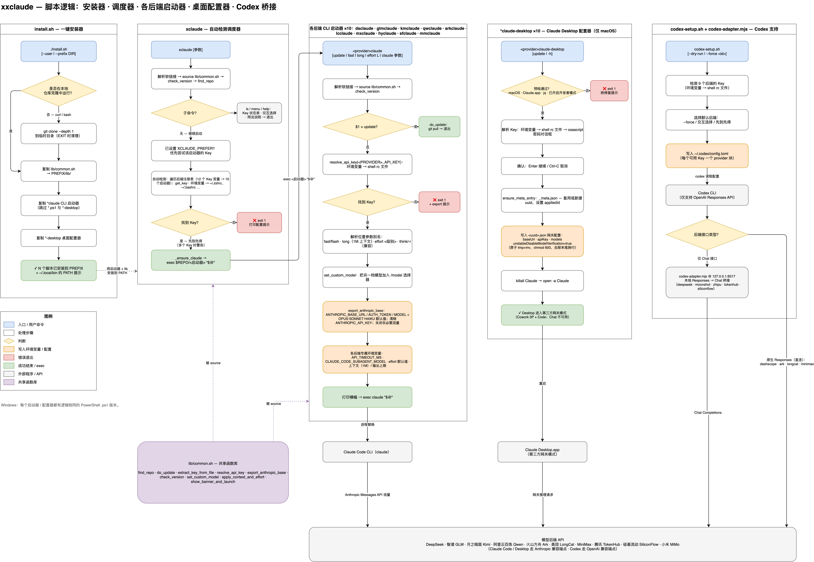

# dsclaude — 面向非 Anthropic 后端的启动器工具集

[English](README.md)

让 [Claude Code](https://claude.ai/code) 和 Claude Desktop 接入 DeepSeek、小米 MiMo、阿里云百炼 Qwen、智谱 GLM、月之暗面 Kimi、火山方舟 Ark、美团 LongCat、MiniMax、腾讯 TokenHub、硅基流动 SiliconFlow 等第三方模型后端的小工具集。

---

## 工具一览

| 脚本 | Agent | 平台 | 后端 | 模型 |
| ------ | ------- | ------ | ------ | ------ |
| **[dsclaude](dsclaude)** | Claude Code (CLI) | macOS / Linux | DeepSeek API（Anthropic 兼容端点） | `deepseek-v4-pro[1m]`（默认，统一推理）· `deepseek-v4-flash[1m]`（快速 / haiku 档位） |
| **[dsclaude.ps1](dsclaude.ps1)** | Claude Code (CLI) | Windows（PowerShell 7+） | DeepSeek API（Anthropic 兼容端点） | 同上 |
| **[mmclaude](mmclaude)** | Claude Code (CLI) | macOS / Linux | 小米 MiMo（Anthropic 兼容端点） | `mimo-v2.5-pro`（默认）· `mimo-v2.5`（快速 / haiku 档位） |
| **[mmclaude.ps1](mmclaude.ps1)** | Claude Code (CLI) | Windows（PowerShell 7+） | 小米 MiMo（Anthropic 兼容端点） | 同上 |
| **[qwclaude](qwclaude)** | Claude Code (CLI) | macOS / Linux | 阿里云百炼 Qwen（Anthropic 兼容端点） | `qwen3.7-max`（默认）· `qwen3.6-flash`（快速 / haiku 档位）· `qwen3.6-plus`（Coding Plan） |
| **[qwclaude.ps1](qwclaude.ps1)** | Claude Code (CLI) | Windows（PowerShell 7+） | 阿里云百炼 Qwen（Anthropic 兼容端点） | 同上 |
| **[glmclaude](glmclaude)** | Claude Code (CLI) | macOS / Linux | 智谱 AI GLM（Anthropic 兼容端点） | `glm-5.2`（默认）· `glm-4.7`（快速 / haiku 档位） |
| **[glmclaude.ps1](glmclaude.ps1)** | Claude Code (CLI) | Windows（PowerShell 7+） | 智谱 AI GLM（Anthropic 兼容端点） | 同上 |
| **[kmclaude](kmclaude)** | Claude Code (CLI) | macOS / Linux | 月之暗面 Kimi（Anthropic 兼容端点） | `kimi-k3`（默认）· `kimi-k2.5`（快速 / haiku 档位） |
| **[kmclaude.ps1](kmclaude.ps1)** | Claude Code (CLI) | Windows（PowerShell 7+） | 月之暗面 Kimi（Anthropic 兼容端点） | 同上 |
| **[arkclaude](arkclaude)** | Claude Code (CLI) | macOS / Linux | 火山方舟 Ark（Anthropic 兼容端点） | `doubao-seed-2.0-code`（默认）· `doubao-seed-2.0-pro`（平衡）· `doubao-seed-2.0-lite`（快速） + Kimi/DeepSeek/GLM/MiniMax 别名 |
| **[arkclaude.ps1](arkclaude.ps1)** | Claude Code (CLI) | Windows（PowerShell 7+） | 火山方舟 Ark（Anthropic 兼容端点） | 同上 |
| **[lcclaude](lcclaude)** | Claude Code (CLI) | macOS / Linux | 美团 LongCat（Anthropic 兼容端点） | `LongCat-2.0`（默认，1M 上下文）· `LongCat-Flash-Chat`（快速）· `LongCat-Flash-Thinking`（深度思考） |
| **[lcclaude.ps1](lcclaude.ps1)** | Claude Code (CLI) | Windows（PowerShell 7+） | 美团 LongCat（Anthropic 兼容端点） | 同上 |
| **[mxclaude](mxclaude)** | Claude Code (CLI) | macOS / Linux | MiniMax（Anthropic 兼容端点） | `MiniMax-M3`（默认，1M 上下文）· `MiniMax-M2.5`（快速） |
| **[mxclaude.ps1](mxclaude.ps1)** | Claude Code (CLI) | Windows（PowerShell 7+） | MiniMax（Anthropic 兼容端点） | 同上 |
| **[hyclaude](hyclaude)** | Claude Code (CLI) | macOS / Linux | 腾讯 TokenHub（Anthropic 兼容端点） | `hy3-preview`（默认）+ DeepSeek/Kimi/GLM/MiniMax/Qwen 别名 |
| **[hyclaude.ps1](hyclaude.ps1)** | Claude Code (CLI) | Windows（PowerShell 7+） | 腾讯 TokenHub（Anthropic 兼容端点） | 同上 |
| **[sfclaude](sfclaude)** | Claude Code (CLI) | macOS / Linux | 硅基流动 SiliconFlow（Anthropic 兼容端点） | `deepseek-ai/DeepSeek-V4-PRO`（默认）+ Kimi/GLM/Qwen/Yi/R1 别名 |
| **[sfclaude.ps1](sfclaude.ps1)** | Claude Code (CLI) | Windows（PowerShell 7+） | 硅基流动 SiliconFlow（Anthropic 兼容端点） | 同上 |
| **[xclaude](xclaude)** | 统一自动检测启动器 | macOS / Linux | 任意（自动检测已设置的 API Key） | — |
| **[dsclaude-desktop](dsclaude-desktop)** | Claude Desktop (GUI) | macOS | DeepSeek API（Anthropic 兼容端点） | `deepseek-v4-pro` · `deepseek-v4-flash`（均启用 1M 上下文） |
| **[dsclaude-desktop.ps1](dsclaude-desktop.ps1)** | Claude Desktop (GUI) | Windows（Store 版 & 标准安装） | DeepSeek API（Anthropic 兼容端点） | 同上 |
| **[mmclaude-desktop](mmclaude-desktop)** | Claude Desktop (GUI) | macOS | 小米 MiMo（Anthropic 兼容端点） | `mimo-v2.5-pro` · `mimo-v2.5` |
| **[mmclaude-desktop.ps1](mmclaude-desktop.ps1)** | Claude Desktop (GUI) | Windows | 小米 MiMo（Anthropic 兼容端点） | 同上 |
| **[qwclaude-desktop](qwclaude-desktop)** | Claude Desktop (GUI) | macOS | 阿里云百炼 Qwen（Anthropic 兼容端点） | `qwen3.7-max` · `qwen3.6-flash`（按量/Token）· `qwen3.6-plus`（Coding Plan） |
| **[qwclaude-desktop.ps1](qwclaude-desktop.ps1)** | Claude Desktop (GUI) | Windows | 阿里云百炼 Qwen（Anthropic 兼容端点） | 同上 |
| **[glmclaude-desktop](glmclaude-desktop)** | Claude Desktop (GUI) | macOS | 智谱 AI GLM（Anthropic 兼容端点） | `glm-5.2` · `glm-4.7` |
| **[glmclaude-desktop.ps1](glmclaude-desktop.ps1)** | Claude Desktop (GUI) | Windows | 智谱 AI GLM（Anthropic 兼容端点） | 同上 |
| **[kmclaude-desktop](kmclaude-desktop)** | Claude Desktop (GUI) | macOS | 月之暗面 Kimi（Anthropic 兼容端点） | `kimi-k3` · `kimi-k2.5` |
| **[kmclaude-desktop.ps1](kmclaude-desktop.ps1)** | Claude Desktop (GUI) | Windows | 月之暗面 Kimi（Anthropic 兼容端点） | 同上 |
| **[arkclaude-desktop](arkclaude-desktop)** | Claude Desktop (GUI) | macOS | 火山方舟 Ark（Anthropic 兼容端点） | `doubao-seed-2.0-code` · `doubao-seed-2.0-pro` · `doubao-seed-2.0-lite` + Kimi/DeepSeek/GLM/MiniMax |
| **[arkclaude-desktop.ps1](arkclaude-desktop.ps1)** | Claude Desktop (GUI) | Windows | 火山方舟 Ark（Anthropic 兼容端点） | 同上 |
| **[lcclaude-desktop](lcclaude-desktop)** | Claude Desktop (GUI) | macOS | 美团 LongCat（Anthropic 兼容端点） | `LongCat-2.0` · `LongCat-Flash-Chat` |
| **[lcclaude-desktop.ps1](lcclaude-desktop.ps1)** | Claude Desktop (GUI) | Windows | 美团 LongCat（Anthropic 兼容端点） | 同上 |
| **[mxclaude-desktop](mxclaude-desktop)** | Claude Desktop (GUI) | macOS | MiniMax（Anthropic 兼容端点） | `MiniMax-M3` · `MiniMax-M2.5` |
| **[mxclaude-desktop.ps1](mxclaude-desktop.ps1)** | Claude Desktop (GUI) | Windows | MiniMax（Anthropic 兼容端点） | 同上 |
| **[hyclaude-desktop](hyclaude-desktop)** | Claude Desktop (GUI) | macOS | 腾讯 TokenHub（Anthropic 兼容端点） | `hy3-preview` + DeepSeek/Kimi/GLM/MiniMax/Qwen |
| **[hyclaude-desktop.ps1](hyclaude-desktop.ps1)** | Claude Desktop (GUI) | Windows | 腾讯 TokenHub（Anthropic 兼容端点） | 同上 |
| **[sfclaude-desktop](sfclaude-desktop)** | Claude Desktop (GUI) | macOS | 硅基流动 SiliconFlow（Anthropic 兼容端点） | `deepseek-ai/DeepSeek-V4-PRO` + Kimi/GLM/Qwen/Yi/R1 |
| **[sfclaude-desktop.ps1](sfclaude-desktop.ps1)** | Claude Desktop (GUI) | Windows | 硅基流动 SiliconFlow（Anthropic 兼容端点） | 同上 |
| **[skills/deepseek-vision](skills/deepseek-vision/)** | skill（任何加载 SKILL.md 的 agent） | macOS / Linux | DashScope（OpenAI/Anthropic 兼容） | `qwen3.6-flash`（默认视觉模型） |
| **[dsvision-mcp](dsvision-mcp)** | MCP server（Claude Desktop / Cowork / 任何 MCP 客户端） | macOS / Linux | DashScope | `qwen3.6-flash`（默认视觉模型） |

---

## 工作原理



脚本逻辑总览：安装器、`xclaude` 自动检测调度器、各后端 CLI 启动器、Claude Desktop 配置器与 Codex 桥接，全部共享 `lib/common.sh`。PNG 内嵌 draw.io XML，用 [draw.io](https://app.diagrams.net) 打开即可继续编辑（[中文源文件](docs/xxclaude-logic-cn.drawio) · [English version](docs/xxclaude-logic.drawio.png)）。

---

## macOS 快速开始

```bash
# 一行安装（推荐）：
curl -fsSL https://raw.githubusercontent.com/Agents365-ai/dsclaude/main/install.sh | bash

# 或用户目录安装（无需 sudo）：
curl -fsSL https://raw.githubusercontent.com/Agents365-ai/dsclaude/main/install.sh | bash -s -- --user

# 或手动安装：
git clone https://github.com/Agents365-ai/dsclaude.git
cd dsclaude
chmod +x xclaude
./xclaude
```

## Windows 快速开始

```powershell
# 一行安装（建议以管理员运行 PowerShell）：
irm https://raw.githubusercontent.com/Agents365-ai/dsclaude/main/install.ps1 | iex

# 安装并自动添加 PATH：
irm https://raw.githubusercontent.com/Agents365-ai/dsclaude/main/install.ps1 | iex -AddToPath

# 然后启动：
pwsh -File xclaude.ps1
```

---

## xclaude — 统一自动检测启动器

不记得该用哪个脚本？`xclaude` 自动检测你设置的 API Key 并委托给对应的后端启动器。

```bash
# 在 ~/.zshrc 中设置任意一个即可：
export DEEPSEEK_API_KEY=sk-...     # → dsclaude
export GLM_API_KEY=...              # → glmclaude
export KIMI_API_KEY=sk-...          # → kmclaude
export ARK_API_KEY=...              # → arkclaude
# ... 或其他支持的 Key

xclaude                  # 自动检测并启动
xclaude fast             # 使用 fast/flash 档位
xclaude long effort max  # 1M 上下文 + max 推理等级
xclaude kimi             # 转发：在 Ark/TokenHub 上 → kimi 模型
```

所有位置参数（模型别名、`fast`、`long`、`effort` 等）均透传给底层启动器。如果同时设置了多个 Key，按检测顺序选第一个；可设置 `XCLAUDE_PREFER=dsclaude` 来强制指定。

---

## dsclaude — Claude Code 接入 DeepSeek

遵循 [DeepSeek Anthropic API](https://api-docs.deepseek.com/guides/anthropic_api) 指南。

```bash
export DEEPSEEK_API_KEY=sk-xxxxxxxxxxxxxxxxxx   # 添加到 ~/.zshrc

dsclaude                 # 默认 deepseek-v4-pro（完整推理）
dsclaude fast            # deepseek-v4-flash（更快更便宜）
dsclaude long            # 1M 上下文窗口
dsclaude long fast       # 1M + flash
```

自动设置 DeepSeek 推荐的环境变量（`ANTHROPIC_BASE_URL`、模型映射、`CLAUDE_CODE_EFFORT_LEVEL=max`），并在 `/model` 选择器中暴露备选模型。上下文窗口上限可通过 `DSCLAUDE_MAX_TOKENS` 覆盖，effort 级别通过 `DSCLAUDE_EFFORT` 覆盖。

> 两个模型都原生支持 1M token，在 Claude Code 中需加 `[1m]` 后缀（如 `deepseek-v4-pro[1m]`），脚本已自动处理。
>
> Windows（PowerShell 7+）：`pwsh -File ./dsclaude.ps1`（参数相同）。

---

## mmclaude — Claude Code 接入小米 MiMo

```bash
export MIMO_API_KEY=sk-xxxxxxxxxxxxxxxxxx       # 按量付费
# 或
export MIMO_API_KEY=tp-xxxxxxxxxxxxxxxxxx       # Token Plan

mmclaude                  # 启动 mimo-v2.5-pro
mmclaude fast             # 启动 mimo-v2.5（更便宜 / 更快的 flash 档）
mmclaude update           # git pull 拉取更新
```

按 key 前缀自动选择 base URL（`sk-*` → 公网，`tp-*` → Token Plan），可用 `MIMO_BASE_URL` 覆盖。main/opus/sonnet 槽位使用 `mimo-v2.5-pro`，haiku 与子代理（subagent）档使用 `mimo-v2.5`（flash）；`mmclaude fast` 会把主模型切到 flash，另一档会出现在 `/model` 选择器里以便会话中切换。自动 unset `ANTHROPIC_API_KEY`（避免遮蔽 bearer token）。可用 `MIMO_MODEL` / `MIMO_FLASH_MODEL` 覆盖两档模型。

> Windows（PowerShell 7+）：`pwsh -File ./mmclaude.ps1`（参数相同）。

---

## qwclaude — Claude Code 接入阿里云百炼 Qwen

```bash
# 每个套餐一把 key，分别来自百炼控制台不同入口：
export DASHSCOPE_API_KEY=sk-xxxxxxxxxxxxxxxxxx      # 按量付费
export DASHSCOPE_CP_API_KEY=sk-xxxxxxxxxxxxxxxxxx   # Coding Plan
export DASHSCOPE_TP_API_KEY=sk-xxxxxxxxxxxxxxxxxx   # Token Plan 团队版

# macOS / Linux — 三个模型档位
qwclaude                  # 按量付费，qwen3.7-max（北京）     → DASHSCOPE_API_KEY
qwclaude plus             # qwen3.7-plus（平衡之选，约 max 的 1/6 价格）
qwclaude max              # 显示指定 qwen3.7-max
qwclaude fast             # qwen3.6-flash 作主模型
qwclaude intl             # 按量付费，新加坡端点
qwclaude coding           # Coding Plan（qwen3.7-plus 推荐）  → DASHSCOPE_CP_API_KEY
qwclaude coding plus      # Coding Plan，qwen3.7-plus（默认）
qwclaude coding fast      # Coding Plan，qwen3.6-plus
qwclaude token            # Token Plan（qwen3.7-max）         → DASHSCOPE_TP_API_KEY
qwclaude token plus       # Token Plan，qwen3.7-plus
qwclaude update           # git pull 拉取更新

# Windows（PowerShell 7+）
pwsh -File ./qwclaude.ps1 coding
```

按所选套餐与模型档位自动选择 base URL、模型阵容与 API key 变量。三个模型档位：

| 档位 | 按量付费 / Token Plan | Coding Plan |
| ------ | ---------------------- | ------------- |
| **max**（默认） | `qwen3.7-max`（旗舰推理） | 不可用 |
| **plus** | `qwen3.7-plus`（平衡，约 max 的 1/6） | `qwen3.7-plus`（推荐） |
| **flash**（subagent/haiku 档） | `qwen3.6-flash` | `qwen3.6-plus` |

Main/opus/sonnet 槽位运行所选档位（默认 `qwen3.7-max`），haiku 与子代理（subagent）档始终使用 flash 模型。`fast` 把主模型切到 flash；`plus` 切到 qwen3.7-plus。另一档会出现在 `/model` 选择器里以便会话中切换。设置 `CLAUDE_CODE_DISABLE_NONESSENTIAL_TRAFFIC=1` 并 unset `ANTHROPIC_API_KEY`，把流量锁定在百炼（避免连到 `api.anthropic.com` 报错）。可用 `QWEN_PLAN` / `QWEN_REGION` / `QWEN_MODEL` / `QWEN_PLUS_MODEL` / `QWEN_FLASH_MODEL` / `QWEN_BASE_URL` 覆盖。

> Windows 版（`qwclaude.ps1`）需要 PowerShell 7+（`winget install Microsoft.PowerShell`），用 `pwsh -File` 运行。

---

## glmclaude — Claude Code 接入智谱 AI GLM

遵循智谱 AI 的 Anthropic 兼容 API。

```bash
export GLM_API_KEY=你的智谱API_KEY              # 添加到 ~/.zshrc
# 在 https://open.bigmodel.cn/usercenter/apikeys 获取你的 key

glmclaude                  # 默认 glm-5.2（完整推理）
glmclaude fast             # glm-4.7（更快更便宜）
glmclaude update           # git pull 拉取更新
```

自动设置智谱推荐的环境变量（`ANTHROPIC_BASE_URL`、模型映射），并在 `/model` 选择器中暴露备选模型。main/opus/sonnet 槽位使用 `glm-5.2`，haiku 与子代理（subagent）档使用 `glm-4.7`；`glmclaude fast` 会把主模型切到 flash，另一档会出现在 `/model` 选择器里以便会话中切换。

默认使用国内端点（`https://open.bigmodel.cn/api/anthropic`）。如需使用海外端点，设置 `GLM_BASE_URL`：

```bash
export GLM_BASE_URL=https://api.z.ai/api/anthropic
glmclaude
```

可用 `GLM_MODEL` / `GLM_FLASH_MODEL` 覆盖两档模型。

> Windows（PowerShell 7+）：`pwsh -File ./glmclaude.ps1`（参数相同）。

---

## kmclaude — Claude Code 接入月之暗面 Kimi

遵循月之暗面 Kimi 的 Anthropic 兼容 API。

```bash
export KIMI_API_KEY=sk-xxxxxxxxxxxxxxxxxx       # 添加到 ~/.zshrc
# 在 https://platform.moonshot.cn/console/api-keys 获取你的 key

kmclaude                  # 默认 kimi-k3（旗舰推理）
kmclaude fast             # kimi-k2.5（更快更便宜）
kmclaude update           # git pull 拉取更新
```

使用 Kimi 官方 Anthropic 兼容端点（`https://api.moonshot.cn/anthropic`）。main/opus/sonnet 槽位使用 `kimi-k3`，haiku 与子代理（subagent）档使用 `kimi-k2.5`；`kmclaude fast` 会把主模型切到 flash，另一档会出现在 `/model` 选择器里以便会话中切换。自动 unset `ANTHROPIC_API_KEY`（避免遮蔽 bearer token）。可用 `KIMI_MODEL` / `KIMI_FLASH_MODEL` 覆盖两档模型，`KIMI_BASE_URL` 覆盖端点地址。

> Windows（PowerShell 7+）：`pwsh -File ./kmclaude.ps1`（参数相同）。

---

## dsclaude-desktop — Claude Desktop GUI 配置器

一键配置 Claude Desktop **内置**的 Third-Party Inference 功能（Developer 菜单），预填 DeepSeek 参数并重启 App。

### 前置条件

1. 已安装 Claude Desktop（[claude.ai/download](https://claude.ai/download)）
2. 已启用 Developer Mode（Help → Troubleshooting → Enable Developer Mode，一次即可）
3. 已设置 `DEEPSEEK_API_KEY` 环境变量

### 用法

```bash
export DEEPSEEK_API_KEY=sk-xxxxxxxxxxxxxxxxxx
./dsclaude-desktop        # 配置并重启
./dsclaude-desktop -h     # 帮助
```

脚本在 `~/Library/Application Support/Claude-3p/configLibrary/` 下生成配置 entry，将其设为 `appliedId`，然后重启 App。原本通过 GUI 添加的其他 entry 不受影响。

### 模式切换

Claude Desktop 启动选择器原生支持 Anthropic ↔ Gateway 切换，无需 `--revert`。在 App 内点头像 → Disconnect，下次启动时选另一个入口即可。

> 唯一不可用的功能是经典 **Chat**（依赖 Anthropic 托管服务且不在 inference API 表面）。需要用 Chat 时切回 Anthropic 模式即可。

### Windows 版本

```powershell
$env:DEEPSEEK_API_KEY = "sk-xxxxxxxxxxxxxxxxxx"
pwsh ./dsclaude-desktop.ps1
```

配置目录为 `%APPDATA%\Claude-3p\configLibrary\`。> 作者未在 Windows 上实测，如有问题请[提 issue](https://github.com/Agents365-ai/dsclaude/issues)。

---
前置条件：Claude Desktop 已安装（Store 版或标准安装均可）、有 DeepSeek API Key。**无需手动启用 Developer Mode**——脚本会自动创建 `developer_settings.json`。

配置目录：`%LOCALAPPDATA%\Claude-3p\configLibrary\`（若为 Store/MSIX 安装，脚本还会额外写入沙箱路径 `LocalCache\Roaming\Claude-3p\configLibrary\` 作为后备）。

已在 Windows 11 + Claude Desktop 1.7196（Windows Store, arm64）上实测通过。

---

## mmclaude-desktop — Claude Desktop 接入小米 MiMo

与 `dsclaude-desktop` 相同的配置器，预填小米 MiMo。读取 `MIMO_API_KEY`，按 key 前缀自动选择 base URL（`tp-*` → Token Plan，否则按量付费；可用 `MIMO_BASE_URL` 覆盖），配置 `mimo-v2.5-pro` + `mimo-v2.5`。

```bash
export MIMO_API_KEY=sk-xxxxxxxxxxxxxxxxxx   # 或 tp-... 表示 Token Plan
./mmclaude-desktop        # 配置并重启（macOS）
./mmclaude-desktop -h     # 帮助

# Windows（PowerShell）
$env:MIMO_API_KEY = "sk-xxxxxxxxxxxxxxxxxx"
pwsh ./mmclaude-desktop.ps1
```

---

## qwclaude-desktop — Claude Desktop 接入阿里云百炼 Qwen

同款配置器，按套餐与模型档位自动选择 base URL、模型与 key 变量。按量付费（`DASHSCOPE_API_KEY`）与 Token Plan（`DASHSCOPE_TP_API_KEY`）配置 `qwen3.7-max` + `qwen3.6-flash`；Coding Plan（`DASHSCOPE_CP_API_KEY`）配置 `qwen3.7-plus` + `qwen3.6-plus`。添加 `plus` 参数可在任意套餐中使用 qwen3.7-plus。

```bash
export DASHSCOPE_API_KEY=sk-xxxxxxxxxxxxxxxxxx       # 按量付费
export DASHSCOPE_CP_API_KEY=sk-xxxxxxxxxxxxxxxxxx    # Coding Plan
export DASHSCOPE_TP_API_KEY=sk-xxxxxxxxxxxxxxxxxx    # Token Plan

./qwclaude-desktop            # 按量付费（北京），qwen3.7-max，然后重启
./qwclaude-desktop plus       # 按量付费，qwen3.7-plus
./qwclaude-desktop intl       # 按量付费，新加坡端点
./qwclaude-desktop coding     # Coding Plan（qwen3.7-plus）
./qwclaude-desktop token      # Token Plan，qwen3.7-max
./qwclaude-desktop token plus # Token Plan，qwen3.7-plus

# Windows（PowerShell）
pwsh ./qwclaude-desktop.ps1 -Plan coding
pwsh ./qwclaude-desktop.ps1 -Plan token -ModelTier plus
```

> 两个 `.ps1` Windows 版移植自 `dsclaude-desktop.ps1`，**作者未在 Windows 上实测**，如有问题请[提 issue](https://github.com/Agents365-ai/dsclaude/issues)。两个配置器都会设置 `unstableDisableModelVerification`，让 Claude Desktop 接受非 Anthropic 的模型名；与 `dsclaude-desktop` 一样，网关启用期间 Chat 模式不可用。

## glmclaude-desktop — Claude Desktop 接入智谱 AI GLM

同款配置器，预填智谱 GLM。读取 `GLM_API_KEY`，配置 `glm-5.2` + `glm-4.7`。

```bash
export GLM_API_KEY=你的智谱API_KEY
./glmclaude-desktop        # 配置并重启（macOS）
./glmclaude-desktop -h     # 帮助

# Windows（PowerShell）
$env:GLM_API_KEY = "你的智谱API_KEY"
pwsh ./glmclaude-desktop.ps1
```

可通过 `GLM_BASE_URL` 覆盖 base URL（默认：`https://open.bigmodel.cn/api/anthropic`）。

---

## kmclaude-desktop — Claude Desktop 接入月之暗面 Kimi

同款配置器，预填 Kimi。读取 `KIMI_API_KEY`，配置 `kimi-k3` + `kimi-k2.5`。

```bash
export KIMI_API_KEY=你的Kimi_API_KEY
./kmclaude-desktop        # 配置并重启（macOS）
./kmclaude-desktop -h     # 帮助

# Windows（PowerShell）
$env:KIMI_API_KEY = "你的Kimi_API_KEY"
pwsh ./kmclaude-desktop.ps1
```

可通过 `KIMI_BASE_URL` 覆盖 base URL（默认：`https://api.moonshot.cn/anthropic`）。

---

## arkclaude — Claude Code 接入火山方舟 Ark（Coding Plan）

火山方舟 Ark Coding Plan 是一个多模型聚合平台 — 一次订阅即可使用豆包、Kimi、DeepSeek、GLM、MiniMax 等多家模型。一个 API Key、一个端点、多模型随意切换。

```bash
export ARK_API_KEY=你的Ark_API_KEY           # 添加到 ~/.zshrc
# 在 https://console.volcengine.com/ark 获取你的 key

# 三种豆包档位 + 厂商别名快速切换
arkclaude                  # doubao-seed-2.0-code（代码专项，默认）
arkclaude plus             # doubao-seed-2.0-pro（平衡之选）
arkclaude fast             # doubao-seed-2.0-lite（轻量快速）
arkclaude kimi             # kimi-k2.7-code（Kimi 代码模型）
arkclaude kimi-pro         # kimi-k2.6
arkclaude deepseek         # deepseek-v4-pro
arkclaude deepseek-flash   # deepseek-v4-flash
arkclaude glm              # glm-5.2
arkclaude minimax          # minimax-m2.7
arkclaude update           # git pull 拉取更新
```

使用 Ark Coding Plan 端点（`https://ark.cn-beijing.volces.com/api/coding`）。main/opus/sonnet 槽位运行所选模型，haiku 与子代理（subagent）档始终使用同一家族中最便宜的模型（或 `doubao-seed-2.0-lite` 作为降级）。`/model` 选择器会根据当前选择智能暴露对应备选 — 用 doubao 时暴露 Pro↔Code，用 Kimi 时暴露 K2.6↔K2.7-code 等。设置 `CLAUDE_CODE_DISABLE_NONESSENTIAL_TRAFFIC=1` 并 unset `ANTHROPIC_API_KEY`。可用 `ARK_MODEL` / `ARK_PLUS_MODEL` / `ARK_FLASH_MODEL` / `ARK_BASE_URL` 覆盖。

> Windows（PowerShell 7+）：`pwsh -File ./arkclaude.ps1`（参数相同）。

---

## arkclaude-desktop — Claude Desktop 接入火山方舟 Ark

同款配置器，预填 Ark Coding Plan。读取 `ARK_API_KEY`。支持所有模型别名。

```bash
export ARK_API_KEY=你的Ark_API_KEY
./arkclaude-desktop         # 配置 doubao-seed-2.0-code 并重启
./arkclaude-desktop plus    # doubao-seed-2.0-pro
./arkclaude-desktop kimi    # kimi-k2.7-code
./arkclaude-desktop deepseek # deepseek-v4-pro
./arkclaude-desktop glm     # glm-5.2
./arkclaude-desktop minimax # minimax-m2.7
./arkclaude-desktop -h      # 帮助

# Windows（PowerShell）
$env:ARK_API_KEY = "你的Ark_API_KEY"
pwsh ./arkclaude-desktop.ps1 -ModelTier kimi
```

可通过 `ARK_BASE_URL` 覆盖 base URL（默认：`https://ark.cn-beijing.volces.com/api/coding`）。

---

## lcclaude — Claude Code 接入美团 LongCat

LongCat-2.0 是美团自研的 1.6 万亿参数 MoE 大模型，全程国产算力训练，1M 原生上下文窗口。OpenRouter 数据显示 LongCat-2.0 在 Claude Code 月调用量位列全球第二。**公测期间免费** — 每日 50 万 Token。

```bash
export LONGCAT_API_KEY=lc-xxxxxxxxxxxxxxxxxx   # 添加到 ~/.zshrc
# 在 https://longcat.chat/platform 免费获取 key

lcclaude                  # LongCat-2.0（1M 上下文，旗舰模型）
lcclaude fast             # LongCat-Flash-Chat（快速/便宜）
lcclaude think            # LongCat-Flash-Thinking（深度推理）
lcclaude update           # git pull 拉取更新
```

使用 LongCat 官方 Anthropic 兼容端点（`https://api.longcat.chat/anthropic`）。main/opus/sonnet 槽位运行所选模型，haiku 与子代理（subagent）档使用 `LongCat-Flash-Chat`。`/model` 选择器暴露备选档位。可用 `LONGCAT_MODEL` / `LONGCAT_FLASH_MODEL` / `LONGCAT_THINK_MODEL` / `LONGCAT_BASE_URL` 覆盖。

> Windows（PowerShell 7+）：`pwsh -File ./lcclaude.ps1`（参数相同）。

---

## lcclaude-desktop — Claude Desktop 接入美团 LongCat

同款配置器，预填 LongCat。读取 `LONGCAT_API_KEY`，配置 `LongCat-2.0` + `LongCat-Flash-Chat`。

```bash
export LONGCAT_API_KEY=lc-xxxxxxxxxxxxxxxxxx
./lcclaude-desktop        # 配置并重启（macOS）
./lcclaude-desktop -h     # 帮助

# Windows（PowerShell）
$env:LONGCAT_API_KEY = "lc-xxxxxxxxxxxxxxxxxx"
pwsh ./lcclaude-desktop.ps1
```

可通过 `LONGCAT_BASE_URL` 覆盖 base URL（默认：`https://api.longcat.chat/anthropic`）。

---

## mxclaude — Claude Code 接入 MiniMax

MiniMax-M3 是 1M 上下文旗舰模型，专为 Agent 推理、工具调用和编程场景优化。**需要使用 Coding Plan（Token Plan）API Key**，按量付费 key 不可用。

```bash
export MINIMAX_API_KEY=你的MiniMax_API_KEY    # 添加到 ~/.zshrc
# 在 https://platform.minimaxi.com 获取你的 key

mxclaude                  # MiniMax-M3（1M 上下文，旗舰模型）
mxclaude fast             # MiniMax-M2.5（快速/便宜）
mxclaude long             # 1M 上下文窗口
mxclaude effort max       # 设置推理等级（low|medium|high|xhigh|max）
mxclaude update           # git pull 拉取更新
```

使用 MiniMax 官方 Anthropic 兼容端点（默认国内：`https://api.minimaxi.com/anthropic`；国际站：`https://api.minimax.io/anthropic`，通过 `MINIMAX_BASE_URL` 设置）。main/opus/sonnet 槽位运行所选模型，haiku 与子代理（subagent）档使用 `MiniMax-M2.5`。`/model` 选择器暴露备选档位。可用 `MINIMAX_MODEL` / `MINIMAX_FLASH_MODEL` / `MINIMAX_BASE_URL` / `MINIMAX_CTX` / `MINIMAX_OUTPUT` / `MINIMAX_EFFORT` 覆盖。

> Windows（PowerShell 7+）：`pwsh -File ./mxclaude.ps1`（参数相同）。

---

## mxclaude-desktop — Claude Desktop 接入 MiniMax

同款配置器，预填 MiniMax。读取 `MINIMAX_API_KEY`，配置 `MiniMax-M3` + `MiniMax-M2.5`。

```bash
export MINIMAX_API_KEY=你的MiniMax_API_KEY
./mxclaude-desktop        # 配置并重启（macOS）
./mxclaude-desktop -h     # 帮助

# Windows（PowerShell）
$env:MINIMAX_API_KEY = "你的MiniMax_API_KEY"
pwsh ./mxclaude-desktop.ps1
```

可通过 `MINIMAX_BASE_URL` 覆盖 base URL默认国内：`https://api.minimaxi.com/anthropic`；国际站：`https://api.minimax.io/anthropic`）。

---

## hyclaude — Claude Code 接入腾讯 TokenHub

腾讯 TokenHub 是多模型聚合平台 — 一次订阅即可使用混元（HY3）、DeepSeek、GLM、Kimi、MiniMax、Qwen 等多家模型。

```bash
export HY_API_KEY=你的API_KEY           # 添加到 ~/.zshrc
# 在 https://cloud.tencent.com/product/lkeap 获取你的 key

hyclaude                  # hy3-preview（腾讯默认）
hyclaude fast             # hy-mt2-lite（轻量快速）
hyclaude deepseek         # deepseek-v4-pro
hyclaude kimi             # kimi-k2.7-code
hyclaude glm              # glm-5.2
hyclaude minimax          # minimax-m3
hyclaude qwen             # qwen3.5-plus
hyclaude long             # 最大上下文窗口
hyclaude effort max       # 设置推理等级（low|medium|high|xhigh|max）
hyclaude update           # git pull 拉取更新
```

使用 TokenHub Anthropic 兼容端点（默认：`https://api.lkeap.cloud.tencent.com/plan/anthropic`）。main/opus/sonnet 槽位运行所选模型，haiku 与子代理（subagent）档使用 `hy-mt2-lite`（或同家族 flash 模型）。`/model` 选择器智能暴露对应备选。可用 `HY_MODEL` / `HY_FLASH_MODEL` / `HY_BASE_URL` / `HY_CTX` / `HY_OUTPUT` / `HY_EFFORT` 覆盖。

> Windows（PowerShell 7+）：`pwsh -File ./hyclaude.ps1`（参数相同）。

---

## hyclaude-desktop — Claude Desktop 接入腾讯 TokenHub

同款配置器，预填 TokenHub。读取 `HY_API_KEY`。支持模型别名选定后端模型。

```bash
export HY_API_KEY=你的API_KEY
./hyclaude-desktop         # 配置 hy3-preview 并重启
./hyclaude-desktop kimi    # kimi-k2.7-code
./hyclaude-desktop deepseek # deepseek-v4-pro
./hyclaude-desktop glm     # glm-5.2
./hyclaude-desktop minimax # minimax-m3
./hyclaude-desktop qwen    # qwen3.5-plus
./hyclaude-desktop -h      # 帮助

# Windows（PowerShell）
$env:HY_API_KEY = "你的API_KEY"
pwsh ./hyclaude-desktop.ps1 -ModelTier kimi
```

可通过 `HY_BASE_URL` 覆盖 base URL（默认：`https://api.lkeap.cloud.tencent.com/plan/anthropic`）。

---

## sfclaude — Claude Code 接入硅基流动 SiliconFlow

硅基流动是多模型平台，聚合了 DeepSeek、Kimi、GLM、MiniMax、Qwen、Yi 等模型。模型名称使用 `provider/Model-Name` 格式（如 `deepseek-ai/DeepSeek-V4-PRO`）。

```bash
export SF_API_KEY=sk-xxxxxxxxxxxxxxxxxx   # 添加到 ~/.zshrc
# 在 https://cloud.siliconflow.cn/account/ak 获取 key

sfclaude                  # deepseek-ai/DeepSeek-V4-PRO（默认）
sfclaude fast             # deepseek-ai/DeepSeek-V3（轻量快速）
sfclaude kimi             # moonshotai/Kimi-K2-Instruct-0905
sfclaude glm              # Pro/zai-org/GLM-5
sfclaude minimax          # Pro/MiniMaxAI/MiniMax-M2.5
sfclaude qwen             # Qwen/Qwen2.5-Coder
sfclaude yi               # 01-ai/Yi-1.5
sfclaude r1               # deepseek-ai/DeepSeek-R1（深度推理）
sfclaude long             # 最大上下文窗口
sfclaude effort max       # 设置推理等级（low|medium|high|xhigh|max）
sfclaude update           # git pull 拉取更新
```

使用硅基流动 Anthropic 兼容端点（`https://api.siliconflow.cn/`）。main/opus/sonnet 槽位运行所选模型，haiku 与子代理（subagent）档使用 `deepseek-ai/DeepSeek-V3`。可用 `SF_MODEL` / `SF_FLASH_MODEL` / `SF_BASE_URL` / `SF_CTX` / `SF_OUTPUT` / `SF_EFFORT` 覆盖。

> Windows（PowerShell 7+）：`pwsh -File ./sfclaude.ps1`（参数相同）。

---

## sfclaude-desktop — Claude Desktop 接入 SiliconFlow

同款配置器，预填硅基流动。读取 `SF_API_KEY`。支持模型别名。

```bash
export SF_API_KEY=sk-xxxxxxxxxxxxxxxxxx
./sfclaude-desktop         # deepseek-ai/DeepSeek-V4-PRO 并重启
./sfclaude-desktop kimi    # moonshotai/Kimi-K2-Instruct-0905
./sfclaude-desktop r1      # deepseek-ai/DeepSeek-R1
./sfclaude-desktop -h      # 帮助

# Windows（PowerShell）
$env:SF_API_KEY = "sk-xxxxxxxxxxxxxxxxxx"
pwsh ./sfclaude-desktop.ps1 -ModelTier kimi
```

---

## deepseek-vision skill — 视觉识别（零依赖方案）

---

## deepseek-vision skill — 视觉识别（零依赖方案）

给纯文本模型（如 DeepSeek）补上"看图"能力的 skill。代理遇到图片时调 `analyze-image` 脚本，发给 Qwen3.6-Flash 识别后将描述返回主模型。

```bash
export DASHSCOPE_API_KEY=sk-xxxxxxxxxxxxxxxxxx
./skills/deepseek-vision/analyze-image /path/to/screenshot.png "图里报的什么错？"
./skills/deepseek-vision/analyze-image https://example.com/diagram.png
```

任何加载 `SKILL.md` 的 agent（Claude Code、Cowork 等）都能用它。默认模型 `qwen3.6-flash`，可通过 `DSVISION_MODEL` 和 `DSVISION_BASE_URL` 切换。

> **限制**：需文件路径或 URL，不支持拖拽/粘贴/「+ → Add files or photos」上传的图片。这类场景请用下方的 **dsvision-mcp**。

---

## dsvision-mcp — 视觉识别（MCP 方案）

功能同上，但以 MCP 服务形式运行，绕过 Cowork 沙箱的两个限制：

1. **网络出口管制** — skill 调 DashScope API 会被沙箱防火墙拦截，MCP 服务跑在沙箱外
2. **内联图片** — 自动读取 `~/.claude/image-cache/` 中最新缓存，拖拽/粘贴/菜单上传均可正常工作（仅 macOS，Windows Cowork 不缓存内联图）

### 安装

```bash
pip3 install fastmcp requests
export DASHSCOPE_API_KEY=sk-xxxxxxxxxxxxxxxxxx   # 建议加到 ~/.zshrc
cd /path/to/dsclaude && pwd    # 记下绝对路径
```

然后根据当前模式，在对应的配置文件中添加 MCP 服务：

| 模式 | 配置文件 |
|------|----------|
| 3P/Gateway（通过 `dsclaude-desktop` 使用 DeepSeek） | `~/Library/Application Support/Claude-3p/claude_desktop_config.json` |
| 标准 Anthropic 模式 | `~/Library/Application Support/Claude/claude_desktop_config.json` |

```json
{
  "mcpServers": {
    "dsvision": {
      "command": "/绝对/路径/dsclaude/dsvision-mcp"
    }
  }
}
```

重启 Claude Desktop 后，`analyze_image` 工具自动出现。

### 用法

```
analyze_image()                           # 自动检测最新缓存图片
analyze_image(image_path="/绝对/路径/foo.png")
analyze_image(focus="图里报的什么错？")     # 自定义 prompt
```

### 常见问题

| 现象 | 排查方向 |
| ------ | ---------- |
| 工具不显示 | 配置文件路径选错 / JSON 格式错误（用 `python3 -m json.tool` 校验） |
| 工具报错 | `DASHSCOPE_API_KEY` 未设置 |
| `ModuleNotFoundError` | 用 `pip3` 而非 `pip` |
| 找不到图片 | 传绝对路径，或检查 `~/.claude/image-cache/` 是否存在 |

### skill vs MCP 怎么选

| 场景 | 推荐 |
| ------ | ------ |
| Claude Code (CLI)，给明确路径 | `skills/deepseek-vision`（零依赖） |
| Cowork / Desktop，拖拽/粘贴内联图 | `dsvision-mcp`（唯一能用的） |
| Cowork，给明确路径，不介意沙箱限制 | 两者均可 |

---

## 赞赏支持

如果这些脚本为你节省了时间，欢迎支持作者：

<table>
  <tr>
    <td align="center"><br><b>微信支付</b></td>
    <td align="center"><br><b>支付宝</b></td>
    <td align="center"><br><b>Buy Me a Coffee</b></td>
    <td align="center"><br><b>打赏鼓励</b></td>
  </tr>
</table>

## 作者

**Agents365-ai** · [Bilibili](https://space.bilibili.com/441831884) · [GitHub](https://github.com/Agents365-ai)

## 开源协议

[CC BY-NC 4.0](LICENSE.md) — 非商业用途免费。**商业使用需获得授权。**
