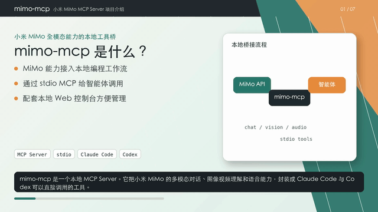

# mimo-mcp

[](https://www.python.org/)
[](LICENSE)
[](https://modelcontextprotocol.io/)
[](https://github.com/Frank-ay/mimo-mcp/releases/latest)



> 上图为 60 秒预览(GIF,自动循环);完整 108 秒含音频版:
> [📥 mimo-mcp-intro.mp4(3.2 MB)](https://github.com/Frank-ay/mimo-mcp/releases/download/v0.1.1/mimo-mcp-intro.mp4)

把小米 [MiMo](https://platform.xiaomimimo.com/) 的全模态能力——多模态对话 / 图像 / 视频理解 / TTS / 声音克隆 / 声音设计 / ASR——封装为一个 **stdio MCP Server**,让 [Claude Code](https://docs.claude.com/en/docs/claude-code) 与 [Codex](https://github.com/openai/codex) 等编程工具直接当 tool 调用,并附带一个**本地 Web 管理面板**(9 个页面:概览 / 沙盒 / 文字转语音 / 图像视频 / 音色库 / 克隆 / 设计 / 语音转写 / 审计)。

**亮点**

- 一处实现,Claude Code & Codex 都能用
- 11 个 MCP tool 覆盖 F1-F8 全模态能力
- 本地 SQLite 持久化音色库,克隆 / 设计的 voice 一次创建到处用
- `mimo.tts` 自动按 voice 类型路由到对应 MiMo 模型(default → tts / clone → voiceclone / design → voicedesign)
- 含 Token Plan 套餐适配 + thinking 模型 max_tokens 兜底等踩坑经验
- Web 控制台支持长文按句末标点自动切段批量合成(SSE 流式渲染)
- TTS 支持 v2.5 自然语言风格指令(导演模式)与音频标签;ASR(`mimo-v2.5-asr`)中英双语 + 方言识别、自动加标点

---

## 1. 三步上手

### 1.1 安装依赖

```bash
# 后端(Python 3.11+ + uv)
uv sync

# 前端(Node 22+ + pnpm)
cd webui/frontend && pnpm install && cd ../..
```

### 1.2 配置 API Key

```bash
cp .env.example .env
# 用编辑器打开 .env,把 MIMO_API_KEY 改成你在 platform.xiaomimimo.com 拿到的真实 key
```

### 1.3 启动

**最快**:一条命令同时拉起 Web 前后端(开发模式),`Ctrl+C` 一起停:

```bash
./scripts/dev.sh        # 后端 :7801 + 前端 :5173(Vite HMR)
```

打开 <http://localhost:5173> 即可看到控制台。

更多启动方式:

| 用途 | 命令 |
|---|---|
| **一键开发**(后端 + 前端,推荐) | `./scripts/dev.sh` |
| stdio MCP server(给 Claude Code / Codex 用) | `./scripts/run_mcp.sh` |
| 仅 Web 控制台后端(:7801) | `./scripts/run_web.sh` |
| 仅前端开发模式(:5173,代理到 7801) | `cd webui/frontend && pnpm dev` |
| 前端构建到 dist(之后只跑后端即可单进程托管) | `./scripts/build_frontend.sh` |

> **生产 / 单进程**:`./scripts/build_frontend.sh && ./scripts/run_web.sh`——构建一次后只跑后端,FastAPI 托管 dist,访问 <http://localhost:7801> 一个地址即可。

#### 脚本 → 底层命令对照

| 脚本 / 命令 | 实际执行 | 端口 / 产物 |
|---|---|---|
| `scripts/dev.sh` | `run_web.sh` + 前端 dev 并行,统一 `Ctrl+C` 退出 | :7801 + :5173 |
| `scripts/run_web.sh` | `source .env` → `uv run --quiet mimo-web` | :7801 |
| `scripts/run_mcp.sh` | `source .env` → `uv run --quiet mimo-mcp` | stdio |
| `scripts/build_frontend.sh` | `cd webui/frontend` →(按需 `pnpm install`)→ `pnpm build` | webui/frontend/dist |
| 前端 dev(`pnpm dev`) | `vite` | :5173 |
| `uv run mimo-web` | `webui.backend.main:main`(FastAPI / uvicorn) | :7801 |
| `uv run mimo-mcp` | `mimo_mcp.server:main`(FastMCP,stdio) | stdio |

#### 验证

```bash
# 后端健康检查(不消耗 token)
curl -s http://127.0.0.1:7801/api/usage/health | python3 -m json.tool

# 前端
curl -s -o /dev/null -w "%{http_code}\n" http://127.0.0.1:5173/
```

后端健康正常时 `api_key_configured / base_url_reachable / auth_valid` 均为 `true`。

#### 停止

- 用 `dev.sh` 或单终端启动的:在该终端按 `Ctrl+C`(`dev.sh` 会同时停掉前后端)。
- 后台启动的:`lsof -ti:7801,5173 | xargs kill`

---

## 2. 项目结构(对应 PRD §6.1)

```
src/mimo_mcp/        # 共享 SDK 适配层 + FastMCP server
├── api/             # F1-F8 业务编排
├── client.py        # httpx async,包装 OpenAI 兼容接口
├── config.py        # pydantic-settings,前缀 MIMO_
├── models.py        # 请求/响应/voice 数据模型
├── server.py        # FastMCP 入口,注册 11 个 tool
└── storage.py       # SQLite + 文件存储

webui/
├── backend/         # FastAPI(独立进程,共享 SDK 适配层)
│   └── routers/     # voices / chat / vision / asr / usage
└── frontend/        # Vite + React + TS + Tailwind v4 + shadcn 风格

scripts/             # 启动 / 构建脚本
tests/               # pytest(M0 冒烟覆盖)
data/                # 运行期数据(已 .gitignore)
```

---

## 3. 注册到 Claude Code / Codex

### 3.1 Claude Code(`~/.claude/settings.local.json`)

把下面这段合并到 `mcpServers` 字段:

```json
{
  "mcpServers": {
    "mimo-mcp": {
      "command": "/Users/Frank-ay/Desktop/xiaomi-MIMO/scripts/run_mcp.sh"
    }
  }
}
```

> 也可以直接用 `uv run --directory /Users/Frank-ay/Desktop/xiaomi-MIMO mimo-mcp` 当 command,
> 然后在 `env` 里传 `MIMO_API_KEY`。脚本方式更省心,因为它自动加载 `.env`。

### 3.2 Codex(`~/.codex/config.toml`)

```toml
[mcp_servers.mimo-mcp]
command = "/Users/Frank-ay/Desktop/xiaomi-MIMO/scripts/run_mcp.sh"
```

### 3.3 验证

注册后重启 Claude Code / Codex,问一句 "调用 mimo.health",应该能拿到结构化的健康检查结果。

---

## 4. 11 个 MCP Tool

| Tool | 说明 |
|---|---|
| `mimo.chat` | 多模态对话(messages 兼容 OpenAI) |
| `mimo.image_understand` | 图像理解(url / path / base64) |
| `mimo.video_understand` | 视频理解(URL 模式) |
| `mimo.tts` | 文本合成语音;`instructions` 可传自然语言风格指令(v2.5 导演模式),文本可嵌 `(风格)`/`[音频标签]`/`(唱歌)`。返回 wav 路径 |
| `mimo.voice_clone_create` | 上传参考音频创建克隆音色 |
| `mimo.voice_design_create` | 文字描述生成自定义音色 |
| `mimo.voice_list` | 列出本地音色库 |
| `mimo.voice_delete` | 删除本地音色 |
| `mimo.asr` | 语音转写(mimo-v2.5-asr,走 `/chat/completions` 的 input_audio;支持本地路径 / 直链,language 可选 auto/zh/en,返回纯文本) |
| `mimo.health` | 健康检查(配置 / 网络 / 鉴权 / ASR 可用性) |
| `mimo.usage` | 本地 audit_log 聚合的最近用量 |

> **大文件约定**:tool 入参传"本地路径"或"http(s) URL",**不要传 base64 大对象**(stdio 协议 + 大对象会很慢)。Web UI 上传走 FastAPI 不走 MCP。

---

## 5. 实现状态

| 里程碑 | 状态 | 说明 |
|---|---|---|
| M0 仓库脚手架 | ✅ | 目录结构 / 配置 / 启动脚本 |
| M1 SDK 适配层 | ✅ | `client.py` + `api/*.py` 全部接通真实端点(chat / 图像 / 视频 / TTS / 克隆 / 设计 / ASR) |
| M2 MCP 工具层 | ✅ | 11 个 tool 注册,Claude Code / Codex stdio 冒烟通过 |
| M3 Web 后端 | ✅ | FastAPI 与 SDK 适配层联通(voices / chat / vision / tts / asr / usage) |
| M4 Web 前端 | ✅ | 9 个页面成型并完成真实联调 |
| M5 联调 + 文档 | ✅ | 端到端真实流跑通(克隆 → 入库 → MCP 出音;TTS 风格指令 / ASR 转写实测) |

---

## 6. 关键决策(PRD §15)

| # | 议题 | 选定 |
|---|---|---|
| Q1 | 实现语言 | Python 3.11 + FastMCP(`mcp[cli]`) |
| Q2 | Transport | 仅 stdio |
| Q3 | Web 前端栈 | Vite + React + TS + Tailwind v4 + shadcn 风格 |
| Q4 | MVP 范围 | F1-F8 全量 |
| Q5 | skill 联动 | V1 不做,V2 模板形式 |
| Q6 | ASR 兜底 | 仅 MiMo 云端;Token Plan 含 mimo-v2.5-asr,F7 已实测可用 |

---

## 7. 测试

```bash
uv run pytest -q
```

M0 冒烟覆盖:模块可 import / Storage CRUD / health_check 不抛 / 11 个 tool 完整注册。

---

## 8. 安全

- API Key 仅出现在 `.env`(已 .gitignore),日志不打印
- Web UI 默认 `127.0.0.1`,不暴露公网
- 上传素材保存在本地 `data/artifacts/`,前端禁止外链

---

## 9. Token Plan 套餐使用提示(M1 实测确认)

如果你买的是「Token Plan 套餐」(API Key 以 `tp-` 开头):

1. **必须用专属 base URL**,否则报 `Invalid API Key`。在 platform.xiaomimimo.com 控制台「我的套餐」页面复制「专属 Base URL → 兼容 OpenAI 接口协议」,典型形式 `https://token-plan-cn.xiaomimimo.com/v1`,填到 `.env` 的 `MIMO_BASE_URL`。
2. **套餐含(V2.5 系列)**:V2.5-Pro / V2.5 / V2.5-TTS / V2.5-TTS-VoiceClone / V2.5-TTS-VoiceDesign / V2.5-ASR(`mimo-v2.5-asr`,走 `/chat/completions` 的 input_audio(base64),F7 实测可用,返回纯文本)。**不含**:V2-Flash。
   > ⚠️ **V2 系列下线**:`MiMo-V2-TTS` 已于 2026-06-27 自动转发至 `MiMo-V2.5-TTS`,整个 V2 系列(V2-Pro / V2-Omni / V2-TTS)将于 **2026-06-30 正式下线**、原模型名失效。本仓库默认全部使用 V2.5 系列,不受影响。
3. **v2.5 是 thinking 模型**:返回的 `message.reasoning_content` 是思考链,真正回复在 `message.content`。如果 `max_tokens` 太小(< 1024)会只见思考、不见回复。本仓库已把默认 `MIMO_DEFAULT_MAX_TOKENS=4096`,长文任务可临时调到 8192+。
4. **使用范围**:套餐合规用法是「在编程工具中使用」(Claude Code / Codex / OpenCode 等);本仓库的 mimo-mcp 正属于这类。Web 沙盒在本机做轻量调试也无问题,不要做高频自动化压测。
